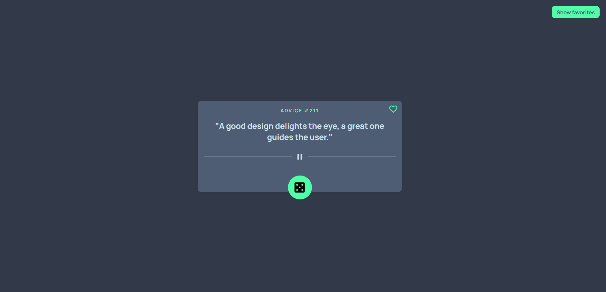

# Advice Slip

<br>
<div align="center">
  <a href="https://project-advice-slip.netlify.app">
    
      <br><br> 
    
  </a>
</div>

<br>

## Tech Stack

<div>
  
  
  
  
  
</div>
<br>

## Key Features

- Generates random advice using the Advice Slip API
- Interface design was created to ensure simple and efficient navigation, with well-defined buttons and accessible functionalities
- Implemented a feature that allows users to add and save favorite advice in a centralized location. They can quickly access these favorites and remove them if they are no longer of interest
- It is optimized to be fully responsive
<br>

## Getting Started

1. **Clone the repository:**

   ```bash
   git clone https://github.com/MarinaDiana01/advice-slip.git
   cd advice-slip
   ```

2. **Install dependencies:**

    ```bash
   npm install
   ```
3. **Start the development server:**

    ```bash
   npm run dev
   ```

    
